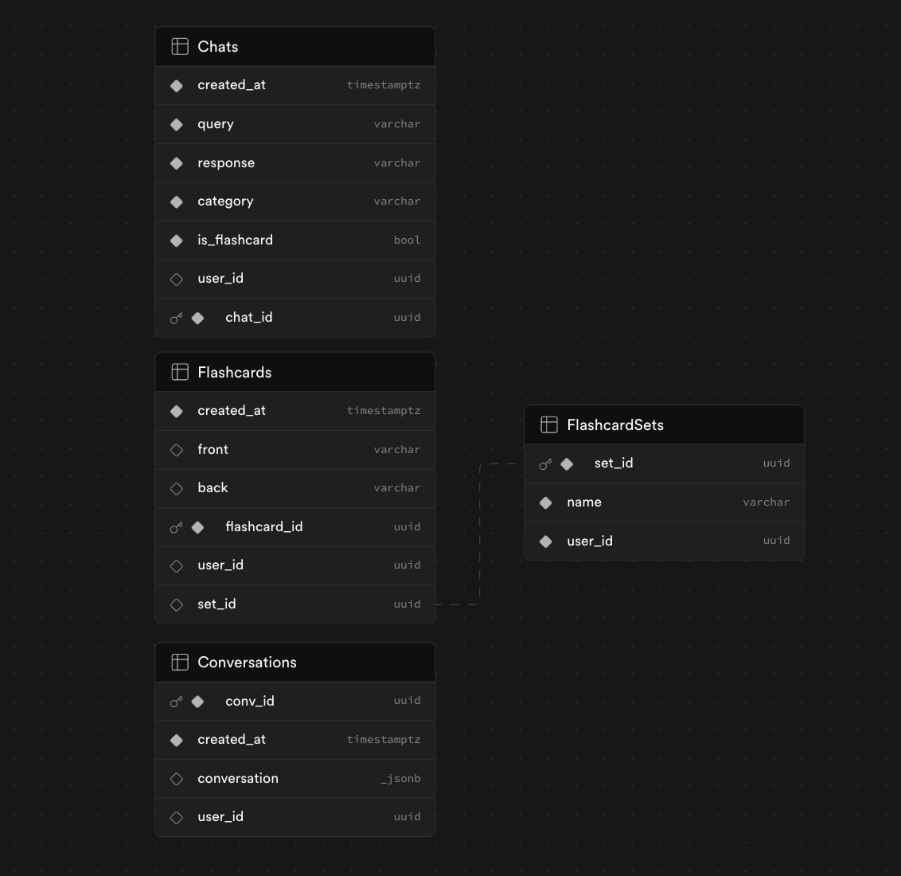

## Team

Edmond Niu - edmond.niu@gmail.com
Krishna Katakota - krk131@pitt.edu
Rahul Anantuni - anantuni.rahul@gmail.com
Eric Wang - eric_wang@college.harvard.edu

## What it does

Gem Learn can be used just like Gemini, but with the added functionality of being able to save query and response pairs in a simple flash card format! We noticed that the responses from Gemini are usually pretty long, so we have a custom prompt engineering pipeline that tailors the response length to be perfect for flashcards. The user can also edit the flashcard before saving it to the database, allowing for flexibility in card creation. Once the flashcards are in the database, they can be managed by placing them in user-created sets, modifying, or deleting them. We also included an analytics panel to look at categorical trends in queries to see what you tend to search for most, and a career help page for this busy recruiting season!

## How to use it

Unfortunately, because of Supabase authorization restrictions, in order to use Gem Learn, Supabase has to be set up in the same format as ours. The database schema is shown below.



Once a supabase is set up as follows, a .env file has to be setup with a REACT_APP_GEMINI_API_KEY variable with a Gemini API key and a REACT_APP_SUPABASE_API_KEY variable with a supabase api key. After this, the flask-baskend should be run by using

```
pip install -U google-ai-generativelanguage google-auth-oauthlib google-labs-html-chunker
python app.py
```

Some other pip installs might be necessary. Once the flask-backend is running, open another terminal and run

```
npm install
npm start
```

to run Gem Learn! There's functionality to query Gemini, create flashcards, look at analytics, and use the Pitt career help chatbot!

### Check out our video demo!

[Youtube](https://youtu.be/DuvRhxeNME4)
